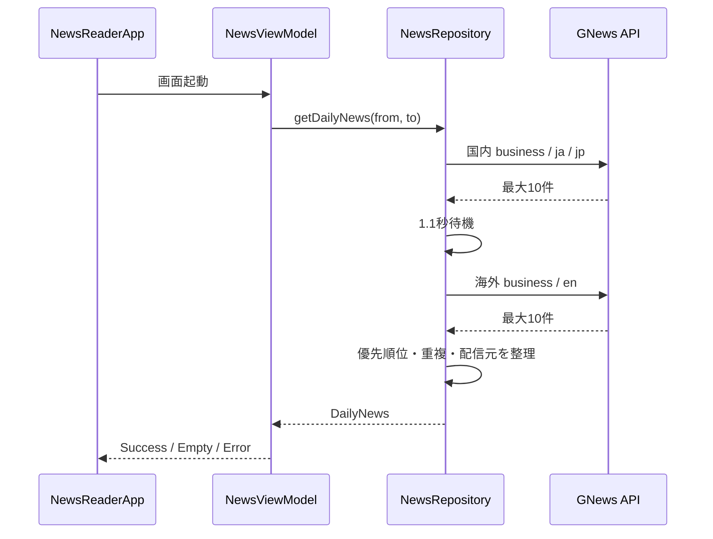

# API通信設計書

## 1. 構成

```text
ui
├── NewsReaderApp
└── news
    ├── NewsViewModel
    └── NewsUiState

domain
├── model
│   ├── DailyNews
│   ├── NewsArticle
│   └── NewsCategory
└── repository
    └── NewsRepository

data
├── remote
│   ├── api/GNewsApi
│   └── dto/GNewsResponseDto
├── mapper/GNewsArticleMapper
└── repository
    ├── GNewsRepository
    └── NewsArticleSelector
```

UIは `NewsRepository` インターフェースだけに依存し、GNews固有のDTOやRetrofitには依存しない。

## 2. 処理フロー



## 3. 依存性注入

Hiltを使用する。

- `NetworkModule` はRetrofit、GNews API、APIキーおよびClockを提供する。
- `RepositoryModule` は `GNewsRepository` を `NewsRepository` として公開する。
- `NewsViewModel` はコンストラクタから `NewsRepository` と `Clock` を受け取る。
- Androidテストでは `RepositoryModule` を `FakeRepositoryModule` に置き換える。

## 4. エラー処理

- Coroutineのキャンセルは再送出する。
- その他の例外は `NewsUiState.Error` に変換する。
- Error状態では再試行操作を提供する。
- APIキーやリクエストヘッダーをログへ出力しない。

## 5. テスト容易性

- DTOからドメインモデルへの変換はMapperとして分離する。
- 記事の優先順位と重複排除は `NewsArticleSelector` として分離する。
- 現在時刻は `Clock` から取得し、固定時刻でViewModelをテストできるようにする。
- UIテストはFake Repositoryを使用し、ネットワークとAPI利用枠に依存しない。
